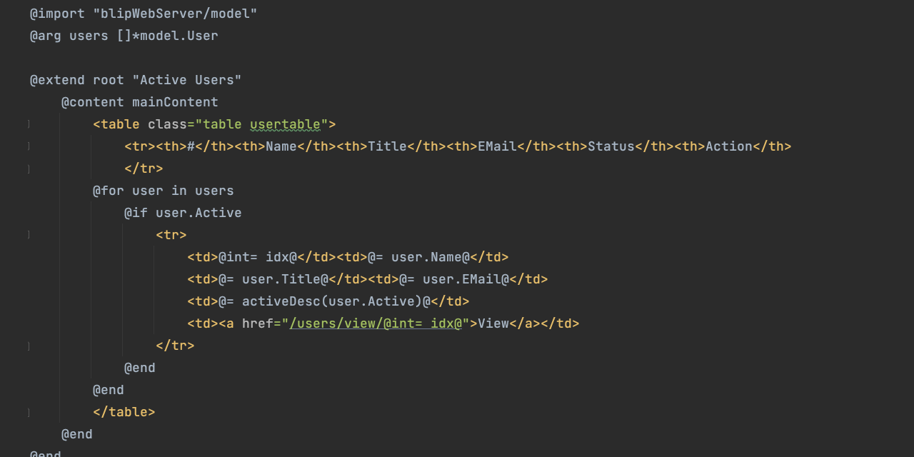

# Blip Template Engine for Go

Blip is a templating language for Go. 
It works by transpiling templates into pure Go and including them at compile time. 
These templates are light wrappers around the Go language itself.  

Benefits:

* Very Fast rendering 
* Compile time type checking,  Type safe!
* Template Extending / Including
* Simple syntax
* Auto-Escaping
* Support passing variables directly and via context
* Extendable escaping / monitoring

Cons:

* Not a dynamic template, will require transpiling and recompiling.
  * blip can watch the project and transpile automatically.
  * air can be used to auto restart applications

# Docs
* See the documentation: [Documentation](/docs/doc.md) 

# Examples 
* See the example blipWebServer: [BlipWebServerExample](https://github.com/samlotti/blip-example) 

# Installing

**Development version**

go get -u github.com/samlotti/blip

**Install the blip command line tool**

go install github.com/samlotti/blip@latest

# Contributing

All contributions are welcome – if you find a bug please report it.

# Security

The @= command will escape based on the mode (filename) of the template.

* html - uses html.EscapeString().
* text - no escaping.
* other - can plug in and IBlipEscaper implementation. 

If any security issues are found with rendering please report it.

# Conbributors

* Sam Lotti (support@hapticappsllc.com)

